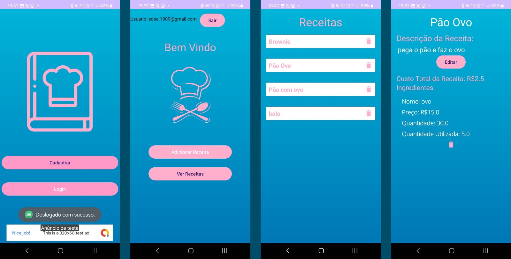

# Receita Aplicativo Android

Este é um aplicativo para dispositivos Android que permite aos usuários guardar e calcular receitas. Ele utiliza Firebase Authentication e Firestore para implementar funcionalidades como cadastro, login, recuperação de senha e armazenamento das informações das receitas.

# Funcionalidades

- Cadastro e Login: Os usuários podem se cadastrar e fazer login na plataforma para acessar suas receitas.
- Recuperação de Senha: Funcionalidade para permitir que os usuários recuperem suas senhas caso as esqueçam.
- Armazenamento de Receitas: As receitas são armazenadas no Firestore, permitindo que os usuários as acessem de qualquer dispositivo.
- Cálculo de Receitas: Recurso para calcular o custo total de uma receita com base nos ingredientes utilizados.

# Tecnologias Utilizadas

- Android Studio: Utilizado para desenvolver o aplicativo para dispositivos Android.
- Firebase Authentication: Para autenticação de usuários.
- Firebase Firestore: Banco de dados NoSQL para armazenamento das receitas e outras informações do usuário.

# Capturas de Tela

Autor
Este aplicativo foi desenvolvido por Eduardo Abrahão.
